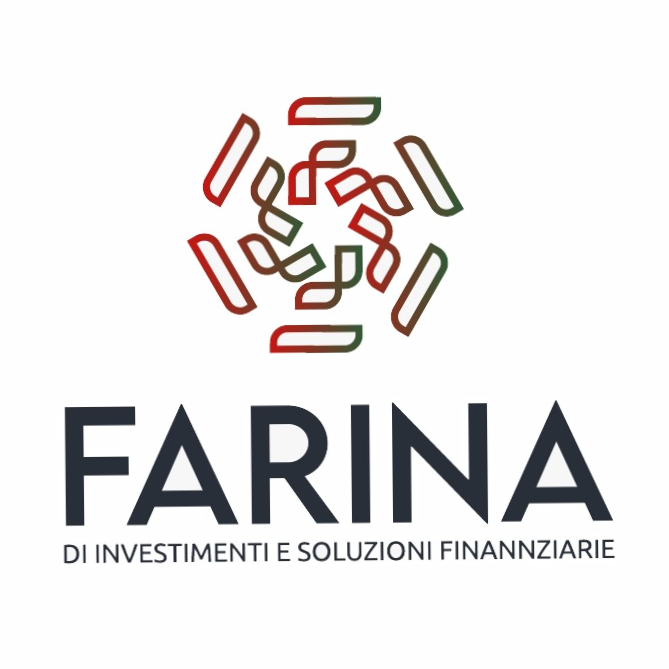
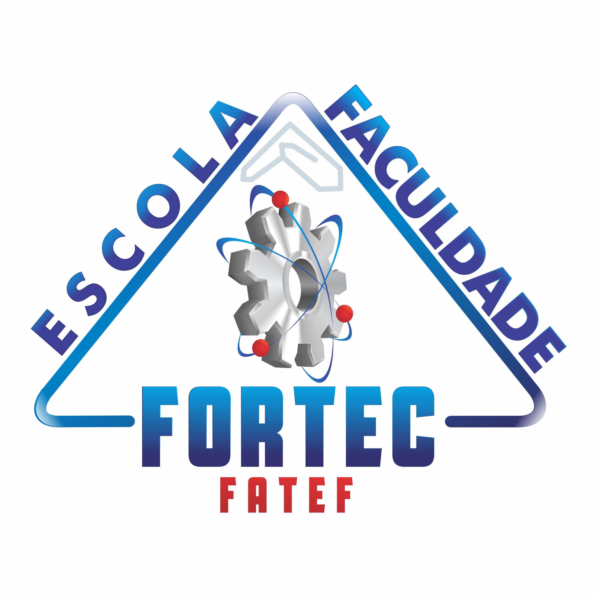

<!-- 
========================================
HELLO WORLD!
========================================
-->

<!-- 
========================================
PARÁGRAFO DE INTRODUÇÃO
========================================
-->

 
Hi, I'm Renan! 👋 I'm a Full Stack Developer and Data Analyst with a strong focus on Machine Learning. I'm currently learning Containerization (Docker) and Cloud Infrastructure, while pursuing my Software Engineering degree at FIAP.

 

<!-- 
========================================
CALENDÁRIO ISOMÉTRICO
========================================
-->

<!-- 
========================================
TECH STACK
========================================
-->
<a href="https://skillicons.dev"> <!-- REACT, VITE E JAVASCRIPT (FRONTEND) -->
  
   
  
</a>
 

<a href="https://skillicons.dev"> <!-- TYPESCRIPT E THREE.JS (FRONTEND) -->
  
  
</a>
 

<a href="https://skillicons.dev"> <!-- NODE.JS, EXPRESS.JS E PYTHON (BACKEND) -->
  
  
  
</a>
 

<a href="https://skillicons.dev"> <!-- TENSORFLOW.JS E PANDAS (DADOS) -->
  
    
</a>

<a href="https://skillicons.dev"> <!-- POWER BI E EXCEL (DADOS) -->
  
  
</a>
 

<!-- 
========================================
EXPERIÊNCIA PROFISSIONAL
========================================
-->
 

  
  
  **IT Intern**  
  **Farina Soluções Financeiras** ­ • ­ Internship  
  `Python`, `Power BI`, `Data Analysis`, 
  `Web Scraping`, `JavaScript`, `Microsoft Excel` 
  Jan, 2026 ­ | ­ *Present* ­ • ­ 4 months

 

  
  
  **IT Intern**  
  **Escola e Faculdade Fortec** ­ • ­ Internship  
  Aug, 2024 ­ | ­ Dec, 2024 ­ • ­ 5 months

 
